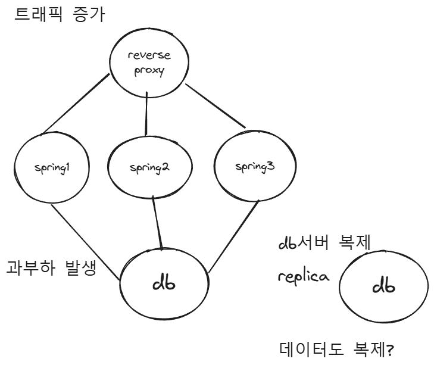

# 저장 프로시저(Stored PROCEDURE)

사용자가 정의한 프로시저

RDBMS에 저장, 사용되는 프로시저

구체적인 하나의 작업을 수행

### 문법

```sql
mysql > delimiter $$
mysql > create procedure product(IN a int, IN b int, OUT result int)
	BEGIN
		SET result = a * b;
	END
	$$
mysql > delimiter ;

mysql > call product(5, 7, @result);
mysql > select @result;

--- mybatis ---
<select statementType="CALLABLE">
	CALL product...
</select>
```

파라미터 정의

- IN(default)
- OUT
- INOUT

```sql
mysql > delimiter $$
mysql > create procedure get_dept_avg_salary()
	BEGIN
		SELECT dept_id, avg(salary)
		from employee
		group by dept_id;
	END
	$$
mysql > delimiter ;

mysql > call get_dept_avg_salary();
```

- 여러개의 구문
    
    사용자가 프로필 닉네임을 바꾸면 
    이전 닉네임을 로그에 저장하고
    새 닉네임으로 업데이트하는 프로시저
    
    ```sql
    mysql > delimiter $$
    mysql > create procedure change_nickname(user_id INT, new_nick varchar(30))
    	BEGIN
    		insert into nickname_logs(
    			select id, nickname, now() from users where id = user_id
    		);
    		update users set nickname = new_nick where id = user_id;
    	END
    	$$
    mysql > delimiter ;
    
    mysql > call change_nickname(1, 'BBAEK');
    ```
    
- 조건문을 통해 분기처리
- 반복문 수행
- 에러 핸들링 등

### 주요 차이점

| **특징** | **Stored Function** | **Stored Procedure** |
| --- | --- | --- |
| **return 키워드 값 반환** | 가능 | 불가능 |
| **파라미터 값 반환** | 일부 가능 | 가능 |
| **호출 방식** | SQL 문장에서 호출 (`SELECT` 등). | 명령문(`CALL` 등)으로 호출. |
| **transaction 사용** | 불가능 | 가능 |
| **사용 목적** | 값 계산, 변환 등 간단한 작업(computation) | 복잡한 작업, 트랜잭션 처리, 다단계 작업 수행(**business logic**) |
| **SQL 문 내 사용** | SQL 쿼리 내에서 사용 가능 | SQL 쿼리 내에서 직접 사용 불가 |

### 장 단점

- 장점
    - 어플리케이션 코드와 SQL 로직을 분리하여 유지보수 용이
    - 여러 곳에서 재사용 가능
    - 네트워크 트래픽 감소
    - 보안 강화
- 단점
    - DB 서버 과부화
    - 신 기능 개발 시 디버깅 어려움, 개발 프로세스 복잡

### 3-tier architecture에서의 관점

Presentation Tier : 사용자에게 보여지는 부분을 담당

Logic Tier : 비즈니스 로직을 담당

Data Tier : 데이터를 저장, 관리, 제공하는 역할을 담당


- Data tier에서 비즈니스 로직을 구현 ⇒ stored procedure 사용
    - 장점
        - application transperant
            
            비즈니스 로직이 수정되면 프로시저만 수정 ⇒ application server를 다시 띄울 필요 X
            
        - 네트워크 트래픽 감소
            1. 프로시저의 이름과 매개변수만 전송
            2. 여러개의 SQL문을 하나의 프로시저로 묶어 실행
        - 재사용성 증가
            
            spring 서버, Fast API 서버.. 등 다양한 서버가 존재할 때 DB에서 logic을 구현하면 application에서 logic을 구현할 필요가 없음
            
    - 단점
        - 유지 관리 보수 비용이 큼
            1. 버전 관리에 취약
            2. 로직을 파악하기 위해 application과 db 로직 체크 
        - 상대적으로 DB 서버 추가가 어려움
            
            
            
            일반적인 경우 : 트래픽 증가 ⇒ CPU 사용량 증가 ⇒ 서버 부하 ⇒ 서버 증설
            
            - DB는 추가적으로 데이터 복제 ⇒ 비용이 큼
        - 항상 transparent 하지 않음
            
            소스코드에 로직이 있는 경우보다 작업 범위 증가, 디버깅 어려움
            
        - transparent 단점
            
            장애 발생시, 전체 시스템 중단 될 위험
            
    - stored procedure 대안
        
        stored procedure의 특장점 : 네트워크 트래픽 감소 ⇒ application 레벨에서 최적화
        
        - sql문이 독립적인 경우 병렬 실행 (non block-io, thread pool 사용)
        - cache : redis 사용