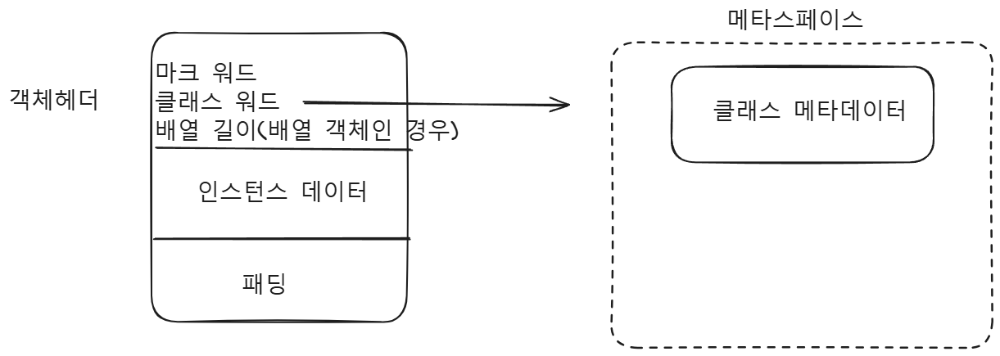

# [Java] Reflection(Annotation)

### Reflection

런타임 시점에서 클래스의 메타데이터를 분석하고, 객체의 속성이나 메소드를 동적으로 접근할 수 있는 기능을 제공

### Annotation

- 코드에 메타데이터를 제공
- 주석과 비슷하지만, 더 많은 기능을 수행(컴파일러나 런타임 도구에게 어떤 것을 알림)

### Java 메타 어노테이션

어노테이션 자체를 설명하거나 어노테이션의 동작 방식을 정의

### @Retention

어노테이션을 어느 정도로 유지할지 설정 

- RetentionPolicy

```java
package java.lang.annotation;

public enum RetentionPolicy {
    SOURCE,
    CLASS,
    RUNTIME
}
```

@Retention

- RetentionPolicy.RUNTIME
    
    어노테이션이 컴파일러에 의해 class 파일(바이트 코드)에 기록됨(JVM 속성 값으로 저장)
    
    런타임 시, JVM에 의해 유지되어 리플렉션을 통해 읽을 수 있음
    

> RetentionPolicy.CLASS
어노테이션이 컴파일러에 의해 class file(바이트 코드)에 기록됨(JVM 속성)
JVM에 의해 유지 안됨 → 리플렉션 API로 조회 불가
> 

### JVM 속성

- 어노테이션은 클래스 파일에서 속성(attribute)으로 저장
- @Retention(RetentionPolicy.RUNTIME) → RuntimeVisibleAnnotations
    - 클래스, 필드, 메서드 선언에 달린 어노테이션 중 런타임에 확인할 수 있는 어노테이션을 나타냄
    - 동적 annotation을 지원하기 위함
    - Reflection을 통해 이용
    - 클래스 메타데이터로 저장

### 참고 : 자바 객체

- 객체의 메모리 레이아웃
    
    
    

> RuntimeInvisibleAnnotations
- 어떤 annotation이 런타임에 유효하지 않은지 나타내는 데 사용
> 
- 코드 예제
    
    
    ```java
    public class Main {
        public static void main(String[] args) {
            MyRuntime myRuntime = new MyRuntime();
    
            MyClass myClass = new MyClass();
        }
    }
    @RuntimeTest
    class MyRuntime{}
    
    @ClassTest
    class MyClass{}
    ```
    
    ```java
    @Retention(RetentionPolicy.RUNTIME)
    public @interface RuntimeTest {
    }
    ```
    
    ```java
    @Retention(RetentionPolicy.CLASS)
    public @interface ClassTest {
    }
    ```
    
- 결과

```java
javap -v ./MyClass.class
...
SourceFile: "Main.java"
RuntimeInvisibleAnnotations:
  0: #14()

```

```java
javap -v ./MyRuntime.class
...
SourceFile: "Main.java"
RuntimeVisibleAnnotations:
  0: #14()

```

### Reflection

@Retention(RetentionPolicy.RUNTIME)을 사용한 클래스는 Reflection API를 사용해서 런타임에 조회 가능

```java
    @Test
    public void test1(){
        Class<?> myClassClazz = MyClass.class;

        Annotation[] classClazzAnnotations = myClassClazz.getAnnotations();
        System.out.println(Arrays.toString(classClazzAnnotations));

        Class<MyRuntime> myRuntimeClazz = MyRuntime.class;

        Annotation[] runtimeClazzAnnotations = myRuntimeClazz.getAnnotations();
        System.out.println(Arrays.toString(runtimeClazzAnnotations));
    }
```

```java
[]
[@org.example.RuntimeTest()]
```

### 예시 : @RequestMapping

```java
@Target({ElementType.TYPE, ElementType.METHOD})
@Retention(RetentionPolicy.RUNTIME)
@Documented
@Mapping
public @interface RequestMapping {
    String name() default "";

    @AliasFor("path")
    String[] value() default {};
    ...
```

- 스프링프레임워크에서 RequestMapping 정보를 생성

```java
    @Nullable
    private RequestMappingInfo createRequestMappingInfo(AnnotatedElement element) {
        RequestMapping requestMapping = (RequestMapping)AnnotatedElementUtils.findMergedAnnotation(element, RequestMapping.class);
        RequestCondition<?> condition = element instanceof Class ? this.getCustomTypeCondition((Class)element) : this.getCustomMethodCondition((Method)element);
        return requestMapping != null ? this.createRequestMappingInfo(requestMapping, condition) : null;
    }
```

1. Annotated element에서 모든 어노테이션을 조회 

```java
    @Nullable
    public static <A extends Annotation> A findMergedAnnotation(AnnotatedElement element, Class<A> annotationType) {
        return !AnnotationFilter.PLAIN.matches(annotationType) && !AnnotationsScanner.hasPlainJavaAnnotationsOnly(element) ? (Annotation)findAnnotations(element).get(annotationType, (Predicate)null, MergedAnnotationSelectors.firstDirectlyDeclared()).synthesize(MergedAnnotation::isPresent).orElse((Object)null) : element.getDeclaredAnnotation(annotationType);
    }
```

1. RequestMappingInfo를 생성

## 어노테이션 기반 스프링

어노테이션을 활용한 설정과 동작을 런타임에 동적으로 처리

### @ComponentScan

정의된 패키지의 클래스를 스캔하여 @Component 어노테이션 클래스가 있는지 확인

- 과정
1. 애플리케이션 초기화 시 클래스 탐색
2. 리플렉션으로 메타데이터 확인
3. BeanDefinition 객체 생성
    - 클래스 타입, 초기화 방법, 의존성 정보 등이 포함
4. 스프링 컨테이너 등록