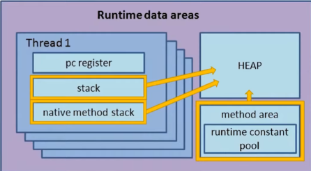

# 다양한 GC(parellel, g1gc 등)

### GC(Garbage Collection)의 역할

1. 살아있거나 사용중인 모든 객체를 인식
2. 죽었거나 사용되지 않는(도달할 수 없는) 모든 객체를 삭제

## GC 알고리즘

### Mark & Sweep

모든 GC의 Fundamental

- 수행 방식
    1. Mark
        
        Root Space로 부터 해당 객체에 접근이 가능한지 판별
        
        > JVM의 Root Space : stack, native method stack, method area
        > 
        > 
        > 
        > 
    2. Sweep
    
    접근이 불가능한 객체를 Heap 메모리에서 삭제
    
- 단점
    1. 메모리 단편화 발생
    2. Stop-the-world 
    
    > Stop-the-world : GC가 객체 삭제를 위해 일시적으로 어플리케이션을 멈추는 것
    > 

### Mark & Sweep & Compact

Compact 과정 추가 : Mark & Sweep 알고리즘의 메모리 단편화 문제를 해결하기 위해 객체 삭제 후 Heap 메모리를 Compact

## Generational Garbage Collector

- 가설
    1. 대부분의 객체는 생성된 후 곧 사라짐
    2. 장수하는 객체는 상대적으로 적음
    
    ⇒ 객체의 생명주기에 따라 힙 메모리를 Young Generation과 Old Generation으로 나누어 관리
    
    
    

### Young Generation 영역에서 메모리 관리

새롭게 생성된 객체가 할당되는 영역

- Young Genration은 3가지 영역으로 나뉘어짐
    1. Eden 메모리 영역
    2. 2개의 Survivor 메모리 영역
- GC 수행 과정(Minor GC)
    
    Minor GC 수행 과정은 아래와 같음
    
    1. Object Allocation : 객체가 메모리 공간에 할당
    2. Copying Referenced Objects : 참조된 객체를 survivor space로 복제
    3. Object Aging : 살아남은 객체를 aging
    4. Additional Aging : 반복
    5. Promotion : 임계치를 넘으면 프로모션 ⇒ 
    - 세부 수행 과정
        
        Young Generation 영역이 채워지면 GC 수행
        
        1. Eden 영역이 채워지면 GC 수행
        2. 살아남은 객체는 S0(Survivor area)로 이동(age 값 1증가)
        3. S0 영역이 채워지면 GC 수행
        4. 살아남은 객체는 S1으로 이동(age 값 1증가)
        5. GC 수행
        6. 이를 반복…
        7. age 값이 임계점을 넘으면 Old Generation으로 이동

### Old Generation 영역에서 메모리 관리

- Young Generation 영역에서 살아남은 객체의 영역
- 영역의 크기가 YG보다 큼
- 상대적으로 GC 적게 발생
- GC 수행 속도 느림
- **Stop-the-world** 시간이 길어짐
- OG 영역의 GC를 Major GC라 부름

> 다른 언어의  GC
> 
> 
> Python : Reference Counting
> 
> JavaScript (V8 engine) : Generational GC ⇒ Node.js, Chrome에서 사용
> 

### Full GC?

Heap 메모리(YG, OG) + metaspace 모두 GC되는 상황

- OG, Metaspace 공간 부족으로 발생
- Stop-the-world 시간이 가장 김
- 여러가지 원인으로 일어날 수 있음
    
    ex) 메모리 누수, 조기 Promotion, 오랫동안 유지되어야 하는 객체가 많은 경우 등
    
    → GC logging으로 문제 파악 필요
    

### Permanent Generation

- JVM Heap의 일부, 고정 크기, 클래스 메타데이터 상수 풀, 메서드 데이터 저장
- Java 7까지만 존재
- Java 8 이후 부터는 Metaspace로 대체

### Metaspace

- 클래스 메타데이터, 상수 풀, 메서드 데이터 저장
- 네이티브 메모리 사용
- 메모리 크기 동적 확장 가능(무제한, 설정 가능)

## HotSpot JVM의 GC

- 성능 인디케이터
    1. Latency : GC 이벤트 중지 시간
    2. Throughput : 생산적인 일 vs 비생산적인 일 ex) 트랜잭션 vs GC 실행시간
    3. Footprint : 메모리, CPU 소비량
    - 로그와 모니터링을 통해 성능 확인

### Serial GC

- 싱글 쓰레드(데몬 쓰레드)로 GC 처리
- Minor GC는 Mark & Sweep, Major GC에선 Mar & Sweep & Compact 사용
- CPU 코어가 1개인 경우 사용
- STW 시간이 김


```bash
java -XX:+UseSerialGC -jar Application.java
```

### Parallel GC

- Java 7 & 8에서 사용
- 병렬 처리(멀티 코어 + 멀티 쓰레드)
- STW 시간이 비교적 짧음

```bash
java -XX:+UseParallelGC -jar Application.java
# -XX:ParallelGCThreads=N : 사용할 쓰레드의 갯수
```

### CMS GC

- 어플리케이션 쓰레드과 GC 쓰레드가 동시 실행
- STW 시간 최소화
- CPU 사용량 높음
- 메모리 파편화 문제
- Java 9에서 deprecated, Java14부터 사용 중지

### G1 GC

Garbage first

Default GC( Java ≥9) 

- 목적
    - STW 시간 최소화
- 특징
    - 멀티 코어 + 대용량 메모리 환경에 적합
    - Generation대신 Region 개념 사용
    - Region 단위로 GC 수행
    - 메모리에 역할을 동적으로 부여
    - Metaspace의 정리를 Full GC 없이도 처리 가능
    - Garbage의 비율이 높은 Region을 우선적으로 처리
- 사용 사례 (CMS 나 ParallelOldGC에서 migration)
    - Full GC 시간이 길고 자주 일어나는 경우
    - 객체 할당과 프로모션이 빈번한 경우
    - compaction pause나 긴 GC를 원하지 않는 경우
- 단계
    
    


STW 발생


STW 발생


STW 발생, 동시성


STW 발생


```bash
java -XX:+UseG1GC -jar Application.java
```

### Shenandoah GC

- Java 12 release
- G1 GC 기반
- Single Generational ⇒ memcopy에 대한 비용 없음
- 작은 단위의 GC를 자주 수행
- 동시성 보장


### ZGC


Java 15 release

- region과 구분되는 ZPage 도입
- STW를 10ms 이하로 수행하는 것이 목적
- Heap의 크기가 증가하더라도 STW이 증가하지 않음
- ZPage는 Small, Medium, Large로 구분


- Colored Pointer
    
    
    
    - Remapped : 재배치 여부를 판단하는 Mark
    - Marked 1 / 0 : 살아있는 객체
- 수행 과정
    - coloring
        
        reachable 객체와 unreachable 객체를 탐색해 표시
        
        멀티스레드로 접근 가능한 객체에 coloring과 remapping을 실행
        
        
            
        
        
    - relocation
        
        garbage를 해제하고 살아있는 객체를 새로운 Zpage에 재할당
        
    - remapping
        
        새로 옮긴 주소를 바라볼 수 있도록 forwarding table을 할당하고 관리
        
        **forwarding table을 통해 GC 과정이 끝나지 않아도 참조 가능(color bit의 remapped flag 1)**
        
        
        
    - reclaimed
        
        빈 ZPage를 회수
        
        
        
    - load barrier
        
        객체가 참조될때마다 밑의 의사 결정 트리에 따라 행동 수행
        
        coloring pointer 정보로 현 객체의 상태를 식별
        
    
    
    

### 비교


### 사용하는 GC 확인 방법

```bash
java -XX:+PrintFlagsFinal
```

java 17 버전은 현재 default로 G1GC를 사용중


> 참고
https://www.oracle.com/technetwork/tutorials/tutorials-1876574.html
https://d2.naver.com/helloworld/0128759
https://github.com/openjdk/jdk/tree/master/src/hotspot/share/gc
>