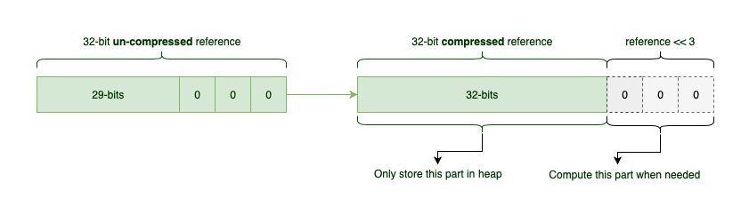

# 자바 메모리관리(Xms, Xmx)

Xms : 초기 힙 크기

Xmx : 최대 힙 크기

Java command line 파라미터로 -Xms, -Xmx를 사용하여 힙 사이즈를 조절

```bash
java -Xms1024m -Xmx2048m -jar application.jar
```

- 힙 메모리를 1204MB로 시작하고 최대 2048MB 사용하도록 설정

Xmx 사이즈를 초과하여 사용할 경우, `Java.lang.OutOfMemoryError` 발생

### 두 옵션을 같은 값으로 설정?

resize가 일어나지 않는 장점이 있음

- GC에서 resize가 일어날 시, Full GC를 실행, STW 시간 증가

### 메모리를 왜 확보?

JVM이 미리 메모리를 확보하면 시스템 콜을 줄일 수 있음

메모리 할당 : c의 malloc() ⇒ 시스템 콜 발생

- 인터럽트
    
    유저 모드에서 커널 모드로 전환 ⇒ 컨텍스트 스위칭 발생
    

### **Heap Size를 어느 정도로 설정?**

Heap 영역은 32GB 미만으로 설정하도록 권고

Xmx값이 32GB보다 큰 경우, JVM은 OOP Compression을 자동으로 끔

- OOP (Ordinary Object Pointer)
    
    객체에 접근하기위한 메모리 상의 주소
    
    - 32bit OOP
        
        2^32 = 최대 4GB 메모리 할당(4GB까지의 주소 공간을 가리킬 수 있음)
        
    - 64bit OOP
        
        2^64 = 최대 18EB 메모리 할당
        
    - Compressed OOP
        
        Heap 영역이 4GB보다 큰 경우 사용
        
        기존보다 8배 더 많은 주소 공간을 표시 가능
        
        OOP는 주소의 오프셋을 가리킴
        
        오프셋은 8의 n 배수를 가리킴
        
        shift 연산을 사용하여 실제 메모리 주소를 찾아감
        
        ```bash
        native_oop = (compressed_oop << 3)
        ```
        
    
    
    
    - Zero-Based Compressed OOP
        
        heap 메모리의 주소가 0번지가 아니면 주소를 찾기 위해 추가적인 ADD 연산 필요
        
        아래와 같이 JAVA_OPTS을 줘서 Zero Based를 확인 
        
        ```bash
        java -Xmx32G -XX:+PrintFlagsFinal -XX:+UnlockDiagnosticVMOptions -XX:+PrintCompressedOopsMode 2>/dev/null |grep Compressed |grep Oops
        
        heap address: 0x0000000080000000, size: 30720 MB, Compressed Oops mode: Zero based, Oop shift amount: 3
        bool PrintCompressedOopsMode                  := true                                {diagnostic}
        bool UseCompressedOops                        := true   
        ```
        
    - 32GB를 초과하여 Compressed OOP를 사용하고 싶은 경우
    `-XX:ObjectAlignmentInBytes` 옵션을 사용하여 기본 정렬 `8byte` 를 256바이트까지 조정 가능
        - 정렬 값이 클수록 낭비되는 공간이 증가할 수 있어 최적화 효과 감소

### 자바 객체

```java
    public static void main(String[] args) {
        class Sample {
            int x;
            double y;
            boolean z;
            Boolean l;
        }
        Sample sample = new Sample();
        System.out.println(ClassLayout.parseInstance(sample).toPrintable());
    }
```


- Boolean은 참조 타입이므로 객체를 생성하고, heap 메모리에 저장
- 추가적인 메모리 오버헤드가 발생
    - 객체 자체의 메모리 관리 비용
    - 객체 헤더(Object Header): JVM은 모든 객체에 대해 헤더 정보를 포함(12~16바이트 정도).
    - 실제 boolean 값을 저장하기 위한 메모리.

> Heap 크기가 커지면 GC 오버헤드 커짐
OOP는 서버의 수평 확장의 긍정적인 근거 중 하나
ZGC에서는 Compressed OOP 지원X
> 

> 참고
 https://docs.oracle.com/cd/E19957-01/820-0524/abzdr/index.html
https://brunch.co.kr/@alden/35
https://stackoverflow.com/questions/24766118/when-is-a-full-gc-triggered
https://www.baeldung.com/jvm-compressed-oops
>