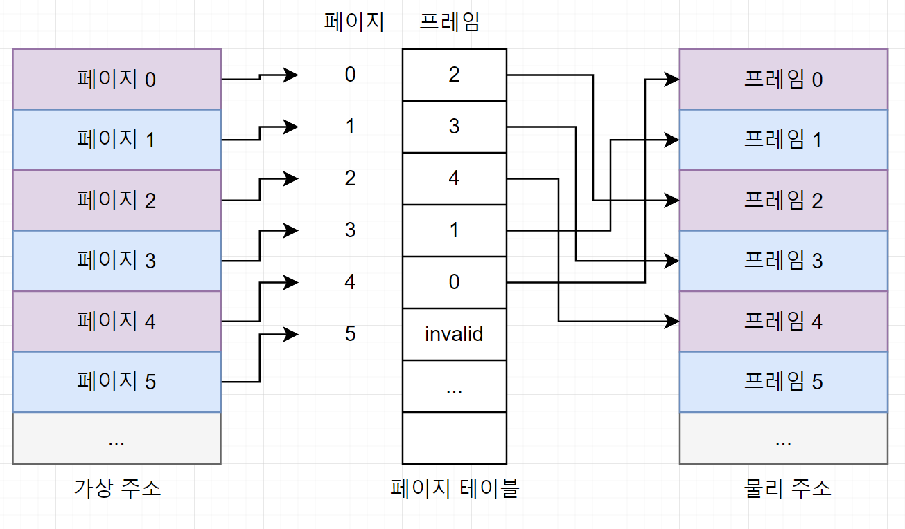

# Paging : Smaller Table

페이지 테이블의 크기를 줄이기 위한 기법

- 페이지 테이블을 줄여야 하는 이유
    - 한정된 자원 : 페이지 테이블이 크면 많은 메모리를 차지
        - 32비트 주소 공간에서 4KB 페이지 크기를 사용하는 경우
            - 한 프로세스의 페이지 테이블 크기 : 4MB
            - 100개의 활성 프로세스 : 400MB 이상 메모리 사용
    - 페이지 테이블이란?
        
        가상 메모리 주소를 물리적 메모리 주소로 변환하는 데 사용되는 자료 구조
        
        프로세스마다 페이지 테이블을 하나씩 갖고 있음
        
        
        

### 해결 방안 1: 큰 페이지 사용

- 페이지 크기를 키워 페이지 테이블 엔트리 개수를 줄임.
    - 16KB 페이지 사용 시:
        - 페이지 테이블 크기: 1MB로 감소.
- 장점:
    - 페이지 테이블 크기 감소.
- 단점:
    - 내부 단편화 발생: 큰 페이지에 데이터가 적게 들어갈 경우 공간 낭비.

### 해결 방안 2: 하이브리드 접근 방식 (페이징 + 세그먼트)

- 가상 주소 공간을 코드, 힙, 스택 등 논리적 세그먼트로 나누고 각 세그먼트에 독립적인 페이지 테이블 사용.
- 작동 원리:
    1. 세그먼트 레지스터에 각 세그먼트의 페이지 테이블 위치 저장.
    2. 세그먼트별 페이지 테이블 크기 최적화.
- 장점:
    - 페이지 테이블 공간 효율성 증가.
- 단점:
    - 세그먼트 기반 접근 방식은 유연성이 떨어짐.
    - 외부 단편화 가능성 증가 : 크기는 충분하지만 공간들이 조각나있어 할당이 불가능

### 해결 방안 3: 다단계 페이지 테이블

- 페이지 테이블을 트리 구조로 나눔.

- 구조:
    - 페이지 디렉토리: 하위 페이지 테이블의 위치 정보 저장.
    - 하위 페이지 테이블: 유효한 페이지만 메모리에 유지.
- 장점:
    - 비어 있는 페이지 테이블 영역에 메모리를 할당하지 않음 → 메모리 절약.
    - 대규모 주소 공간에서 효율적.
- 단점:
    - TLB 미스 시 메모리 접근 횟수 증가 → 성능 저하.
    - 구현 복잡성 증가.

### 해결 방안 4: 역 페이지 테이블

- 물리적 메모리 페이지당 하나의 엔트리를 유지.
    - 각 엔트리는 어떤 프로세스와 가상 페이지가 해당 물리 페이지를 사용하는지 기록.
- 속도 개선:
    - 해시 테이블 사용으로 선형 탐색 문제 해결.
- 장점:
    - 메모리 사용량 극도로 감소.
- 단점:
    - 해시 충돌 시 성능 저하.

### Space-time 트레이드오프

- 작은 페이지 테이블:
    - 메모리 절약 가능.
    - TLB 미스 발생 시 더 많은 메모리 접근 필요 → 성능 저하.
- 큰 페이지 테이블:
    - TLB 미스 시 성능 향상.
    - 메모리 낭비 증가.

### 추가 고려 사항

- 메모리 제약 환경: 작은 페이지 테이블이 적합.
- 대규모 워크로드: 큰 페이지 테이블로 성능 최적화.
- 일부 시스템: 페이지 테이블을 디스크로 스와핑 가능 → 메모리 부족 시 유용.

### 결론

- 페이지 테이블 최적화는 시간과 공간의 균형을 맞추는 문제.
- 상황에 맞는 데이터 구조와 기법을 선택해야 함.